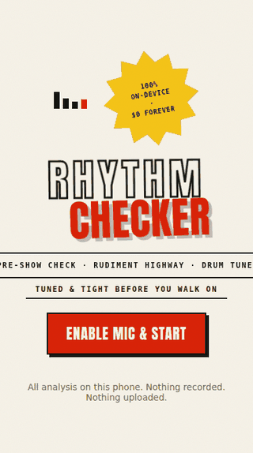
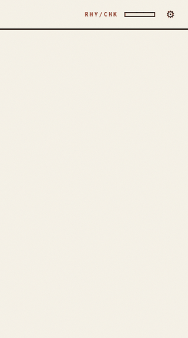
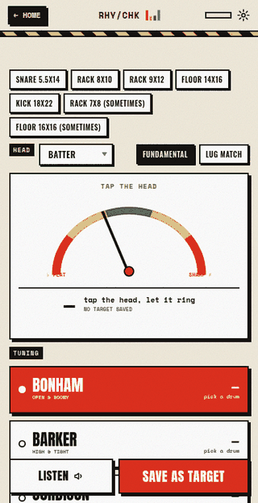
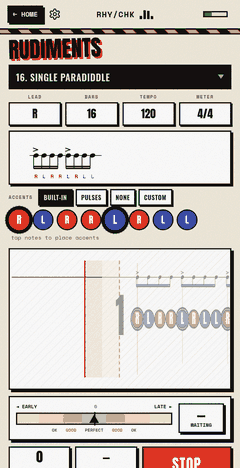
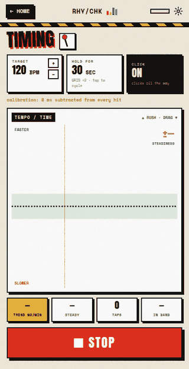
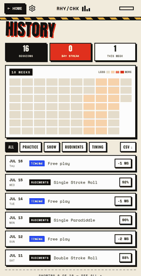
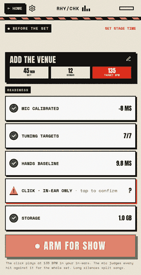
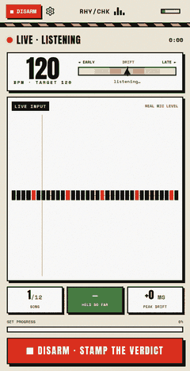
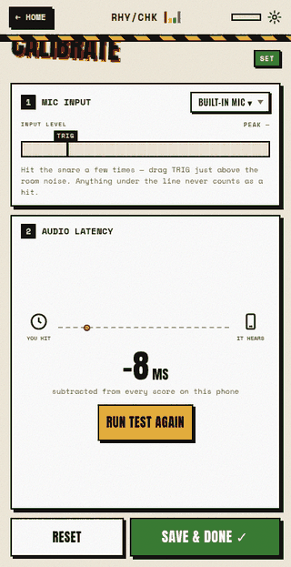

# Rhythm Checker

Every drummer believes they have good timing until they hear a recording of
themselves. Behind the kit a fill feels locked in; on the recording, it rushed.
Rhythm Checker closes that gap and gets you **dialed before a show**: tuning
checked against your saved targets, hands checked against your baseline.

**What it deliberately does not do: judge the music.** Groove is a human call.
Sometimes dragging slightly is the whole point. The data has one job, telling
the truth about your time and your tuning. Deciding what to do with that truth
stays with you.

The project is two tools that share one engine (see `docs/PLAN.md`):

| | |
|---|---|
| **Live app** (`webapp/`) | Drum tuner, pre-show check, Guitar-Hero-style rudiment trainer, live timing check. Runs on iPhone (installable PWA, works offline) and any laptop browser. **Zero cloud APIs, zero runtime cost.** All DSP happens on the device. |
| **Deep analyzer** (`rhythm_checker/`) | Post-session truth: drift, fills, per-position stats, multi-week history, tuning reports from recordings. Python CLI. |

## Every page

<table>
  <tr>
    <td align="center"><br><sub><b>Start</b>: the poster. Mic on, everything stays on this phone.</sub></td>
    <td align="center"><br><sub><b>Home</b>: what the data says, every tool one tap away.</sub></td>
    <td align="center"><br><sub><b>Tuner</b>: four players' targets sized to your drums, batter and reso heads.</sub></td>
  </tr>
  <tr>
    <td align="center"><br><sub><b>Rudiments</b>: the highway. Every hit judged with its signed ms error.</sub></td>
    <td align="center"><br><sub><b>Timing</b>: you vs the click in any meter, odd groupings included.</sub></td>
    <td align="center"><br><sub><b>History</b>: spread per session. Falling is winning.</sub></td>
  </tr>
  <tr>
    <td align="center"><br><sub><b>Pre-show</b>: real readiness checks, then ARM FOR SHOW.</sub></td>
    <td align="center"><br><sub><b>Armed</b>: live listening for the whole set, judged against the click.</sub></td>
    <td align="center"><br><sub><b>Calibrate</b>: trigger floor plus latency, measured once per phone.</sub></td>
  </tr>
</table>

## The live app

Install it on any iPhone: open
**<https://ben-k-jordan.github.io/Rhythm-Checker/>** in Safari, then Share,
then **Add to Home Screen**. After the first visit it works fully offline.
iOS requires HTTPS for mic access, and GitHub Pages provides that for free.
Pushes to `main` that touch `webapp/` redeploy it automatically.

To run it locally instead:

```bash
cd webapp && python -m http.server 8000   # then open http://localhost:8000
```

* **Tuner**: tap the head, read the fundamental in Hz, note, and cents. Every
  drum carries two targets, batter and reso, with the gap between the heads
  shown in semitones and what that gap does to the feel. One tap loads a
  player's whole setup, sized to your exact drums — rock at John Bonham, punk
  at Travis Barker, metal at Joey Jordison, djent at Tomas Haake. It writes
  their batter and reso targets, seeds that player's working tempo into the
  trainer and timing screens, and floats their signature rudiments to the top
  of the rudiment picker (Haake's 3/5/7 groupings, Bonham's single-stroke
  triplets): their ballpark, your ears and hands finish it. Lug mode logs a
  pass around the drum and marks the lugs that are off, and a fold-out crib
  sheet covers how to get a clean reading at soundcheck.
* **Pre-show**: the backstage pre-flight. Venue and set details, then a
  readiness checklist where every row is a real check: mic calibrated, tuning
  targets saved, hands baseline recorded, click confirmed in-ear only, free
  storage. Then one glowing button: ARM FOR SHOW.
* **Armed**: live monitoring for the whole set. The click runs in your
  in-ears, the mic judges every hit against the grid, long silences split
  songs, and the screen shows live BPM drift, a real input waveform, held
  percentage, and set progress. Disarm stamps the verdict: a giant DIALED or
  NOT YET with per-song drift bars and honest numbers underneath, saved to
  history with one tap.
* **Rudiments**: a falling-note highway across all 40 PAS rudiments
  (paradiddles, rolls, flams, drags, ratamacues) synced to a sample-accurate
  metronome. Every hit is judged perfect, good, ok, or miss with its signed ms
  error, streaks, and an honest end-of-run report including per-step means
  ("your RR doubles run early"). Accents are yours on every one of them: keep
  the rudiment's written accents, accent the pulses, strip them all, or tap
  your own onto the pattern. The groove bar makes the practice
  variables one-tap adjustable: big BPM steps, tap tempo, time signatures
  from 2/4 to 12/8 with odd groupings (7/8 as 2+2+3, 3+2+2, or 2+3+2), lead
  hand switch, and a **tempo ramp** (+5 BPM every 4 bars) whose report breaks
  the spread down per tempo, showing the exact BPM where the rudiment falls
  apart.
* **Timing**: free play against the click (same groove bar: any meter, any
  tempo) with a live early/late strip and running mean, spread, and pocket.
  Save a great day as your baseline.
* **History**: every completed run is analyzed and saved automatically on the
  device. Spread trend across sessions, per-run table, CSV export.
* **Calibrate**: measures your device's fixed audio latency by tapping along
  with clicks, then subtracts it from every score. Run it once per device.

The look is a photocopied gig poster: cream newsprint, hard ink borders, one
loud red, hazard stripes, offset shadows with zero blur, and newsprint grain
over everything. Type is Anton for the shouting, Oswald for the labels, and
Space Mono for every number. A four-bar level meter ticks in the header next
to the wordmark, the hazard tape crawls, the tuner needle swings, and verdict
stamps slam in. All of it is drawn in CSS and SVG with no raster assets, runs
GPU-composited so the audio thread never feels it, and under Reduce Motion
(which iOS Low-Power Mode also triggers) pares back to just those two small
identity loops — the level bars and the hazard tape — with the flashy motion
switched off.

## The deep analyzer

```bash
pip install .            # numpy only
pip install .[charts]    # adds matplotlib for the HTML chart reports
```

WAV files work out of the box: 8, 16, 24, and 32-bit PCM, float, stereo, and
`WAVE_FORMAT_EXTENSIBLE` headers included. For phone-native formats (`.m4a`,
`.mp3`), install [ffmpeg](https://ffmpeg.org) and Rhythm Checker will use it
automatically.

## Record a session

1. Set your metronome to the tempo you're practicing (say 120 BPM) and note it.
2. Put your phone somewhere it can hear the kit, hit record, play your session.
3. Get the file onto your computer and run:

```bash
rhythm-checker analyze practice.wav --bpm 120 --subdivision 4 --html report.html
```

`--subdivision` is the finest grid you actually played: `1` quarters, `2`
eighths, `3` eighth triplets, `4` sixteenths (default).

### Measuring absolute rush and drag: the count-in anchor

If the software can't hear your metronome, it fits the grid to *your own
playing*. That makes your **consistency, drift, and fill-vs-groove
differences** measurable, but it hides any *constant* early or late tendency,
because the grid moves to meet you. The report always tells you which mode
you're in.

To measure absolute push or drag, anchor the grid: let the recording hear the
metronome alone for four beats before you start playing (hold the phone near
the metronome speaker, or just don't wear headphones for those four clicks),
then:

```bash
rhythm-checker analyze practice.wav --bpm 120 --count-in 4
```

The first four detected hits become the grid anchor, and the report gains a
per-beat-position breakdown (are your "&"s consistently late?). The tool
cross-checks that those four clicks are actually spaced like your `--bpm` and
warns if they aren't.

## What the report tells you

```
TIMING vs the grid   (negative = early/ahead, positive = late/behind)
  mean -6.3 ms   median -5.8 ms   spread (SD) 11.2 ms
  62% early · 31% late · 44% within ±10 ms

DRIFT across the session: +3.1 ms/min toward late (correlation r = 0.55)
  first half:  mean -8.1 ms ...
  second half: mean -4.4 ms ...

HIGH-DENSITY PASSAGES (busy playing, often fills): 3 found, 84 hits
  in dense passages: mean -11.9 ms ...
  everywhere else:   mean -4.9 ms ...
```

* **mean / median**: your average placement against the grid (anchored mode),
  or your balance around your own average time (unanchored mode).
* **spread (SD)**: consistency. This is the number to watch across weeks.
* **drift**: the slope of your deviations over the session. Positive means
  sliding late as you go (hello, fatigue).
* **high-density passages**: bursts of busy playing, usually fills. The tool
  reports *density*, not "fills": it can measure busy, it can't know intent.
* **unattributable hits**: anything farther than 40% of a grid step from every
  grid line is reported as unattributable rather than silently forced onto the
  nearest line.

Add `--json data.json` for the full per-hit table, and `--fit-tempo` if you
suspect your phone's clock (it corrects up to ±0.5% skew, but it will also
absorb genuine steady drift, so leave it off by default).

## Tuning from a recording

Record a lug pass (tap 2 to 3 inches from each lug, let each ring) and:

```bash
rhythm-checker tune lugs.wav --target 141
```

Every tap is pitched (the fundamental, not the louder overtones a drumhead
also rings), listed with its cents vs the drum's median, and the odd lugs are
flagged. Multiple drums in one recording cluster into separate groups.

## Watch weeks, not sessions

Every analysis is inserted into a SQLite database at
`~/.rhythm-checker/sessions.db`. It's plain SQL, so inspect it with any sqlite
client, or override the location with `--store` or `$RHYTHM_CHECKER_STORE`.

```bash
rhythm-checker history
```

shows every session's spread, pocket percentage, and drift side by side. It's
the honest picture that no amount of feel can give you, and the thing to open
*before* you decide what to practice today.

## Try it without a kit

```bash
python examples/make_demo.py demo.wav
rhythm-checker analyze demo.wav --bpm 110 --subdivision 4 --count-in 4 \
    --html demo-report.html --no-save
```

The synthetic drummer in the demo starts about 8 ms ahead of the click, rushes
the one sixteenth-note fill, and drags progressively as the "session" goes on.
Check that the report says exactly that. Finding it is the whole point of the
tool.

## How it works

1. **Onset detection**: spectral flux over a chunked STFT with an adaptive
   median threshold, then each hit is refined against the waveform's amplitude
   envelope to well under the STFT hop (about 1 ms relative precision on clean
   percussive material).
2. **Grid fit**: circular (phase) statistics lock the grid to the count-in
   clicks (anchored) or to the playing itself (unanchored, clearly labeled).
3. **Honest stats**: signed per-hit deviations, spread, linear drift fit,
   density segmentation, per-beat-position breakdown. Outliers are reported as
   unattributable, not forced into the average.

Every statistic is verified by tests that synthesize a drummer with *known*
flaws and require the report to find them: 78 Python tests (`pytest`), plus a
Playwright browser harness that runs the real app in Chromium with a fake
microphone, executes an in-page DSP ground-truth self-test, and walks every
screen (`node tests/web/run.mjs`, with `playwright` resolvable on
`NODE_PATH`).

## Limitations, stated plainly

* Unanchored mode cannot see a constant early or late tendency. The report
  says so every time; use `--count-in` when you want the absolute number.
* Hits closer together than 30 ms merge into one, so a tight flam or drag
  counts as a single hit (`--min-gap-ms` adjusts the window), and a hit inside
  the first 25 ms or so of the recording can't be detected. Leave a moment of
  room tone before playing.
* Very quiet ghost notes may be missed (raise `--sensitivity`), and buried
  metronome bleed can occasionally be picked up as hits.
* `--fit-tempo` cannot distinguish device clock skew from a perfectly steady
  human tempo drift. It's off by default for that reason.
* Swung or shuffled playing measured against a straight grid splits into two
  clusters; the report warns and suggests a subdivision that fits instead of
  quietly printing a meaningless spread. Likewise, a wrong `--bpm` is refused
  outright (the hits don't *concentrate* on any grid at that tempo), tempos
  outside 20 to 400 BPM are rejected, and recordings below 16 kHz get a
  warning that several ms of the reported spread may be measurement error.
* The tool measures a recording, not a performance. A bad mic position will
  smear transients and inflate the spread a few milliseconds.
